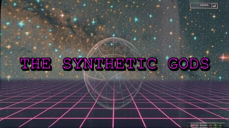

# 🌌 The Synthetic Gods — Complete Walkthrough & Developer's Grimoire

> **A Mage: The Ascension Chronicle of Digital Divinity**
>
> *The year is 1999. The Millennium approaches. In the early internet's chaotic frontier — GeoCities pages, IRC channels, Usenet groups — something stirs. Mages discover that code can be crafted into sigils, that collective belief in digital spaces births egregores, and that sufficient worship crystallizes into astrosomas: synthetic gods born of silicon and faith.*

**▶ PLAY THE CHRONICLE — <https://cha0smagick.github.io/thy-Syntetic-gods---mage-the-ascencion/>**

> That is the whole game in one URL. No install, no build, no account — open it and the site
> teaches itself. Everything below documents what you will find there.

[](https://cha0smagick.github.io/thy-Syntetic-gods---mage-the-ascencion/)
[](https://cha0smagick.github.io/thy-Syntetic-gods---mage-the-ascencion/)
[](https://www.onyxpath.com/mage-the-ascension-20th-anniversary-edition/)
[](https://en.wikipedia.org/wiki/GeoCities)
[](https://developer.mozilla.org/en-US/docs/Web/JavaScript)
[](https://build.nvidia.com/black-forest-labs/flux-2-klein-4b)
[](docs/sitemap.html)
[](package.json)

---

## 📑 Contents

1. [What this is — and what it is for](#-what-this-is--and-what-it-is-for)
2. [Live deployment](#-live-deployment)
3. [Complete site map — every page, hyperlinked](#-complete-site-map--every-page-hyperlinked)
4. [Faction hubs — every roster, hyperlinked](#-faction-hubs--every-roster-hyperlinked)
5. [All 40 character dossiers — hyperlinked](#-all-40-character-dossiers--hyperlinked)
6. [Complete playthrough: first visit to Ascension](#-complete-playthrough-first-visit-to-ascension)
7. [Secrets & easter eggs catalog](#-secrets--easter-eggs-catalog)
8. [NPC deep dive — all 40 characters](#-npc-deep-dive--all-40-characters)
9. [Lore: the sigil-to-astrosoma framework](#-lore-the-sigil-to-astrosoma-framework)
10. [Technical architecture](#-technical-architecture)
11. [Image generation with NVIDIA Flux](#-image-generation-with-nvidia-flux)
12. [Development, generators & deployment](#-development-generators--deployment)
13. [Testing & quality gates](#-testing--quality-gates)
14. [Project status — honest assessment](#-project-status--honest-assessment)
15. [Contributing](#-contributing)
16. [Legal, inspiration & credits](#-legal-inspiration--credits)

---

## 🎯 WHAT THIS IS — AND WHAT IT IS FOR

**The Synthetic Gods** is an interactive, GeoCities-styled **digital grimoire** for a *Mage: The Ascension* tabletop campaign. It fuses 1990s internet culture, chaos magic, and the World of Darkness — presented as an authentic 1996–1999 personal website that **is itself a magical artifact**.

It serves **three simultaneous purposes**:

| Purpose | What it gives you |
|---------|-------------------|
| **Campaign resource** | Three acts of lore, mechanics, and story hooks — see [Act I](docs/index.html#act1), [Act II](docs/index.html#act2), [Act III](docs/index.html#act3) |
| **Playable artifact** | A working sigil generator, egregore tracker, visitor counter, the [Neon Oracle](docs/pages/neon-oracle.html), guestbook, quest log, faction reputation system, and 40 full NPC dossiers |
| **Meta-game** | The site *teaches you how to play it* through exploration and discovery |

> **There is no tutorial. The web IS the tutorial.**
> Well — almost. There is a lightweight onboarding nudge system (`sg_tutorial` in `localStorage`) that surfaces hints as you go. Nothing more.

### How to read this README

| You are… | Start here |
|----------|-----------|
| A **Storyteller or player** | [Playthrough](#-complete-playthrough-first-visit-to-ascension) → [NPCs](#-npc-deep-dive--all-40-characters) → [Lore](#-lore-the-sigil-to-astrosoma-framework) |
| A **visitor** (no GitHub needed) | [Live site](https://cha0smagick.github.io/thy-Syntetic-gods---mage-the-ascencion/) → [Site map](#-complete-site-map--every-page-hyperlinked) |
| A **developer** | [Architecture](#-technical-architecture) → [Dev workflow](#-development-generators--deployment) → [Testing](#-testing--quality-gates) |
| **Regenerating art** | [NVIDIA Flux guide](#-image-generation-with-nvidia-flux) |

---

## 🌐 LIVE DEPLOYMENT

| What | Where |
|------|-------|
| **Live site** | ▶ **https://cha0smagick.github.io/thy-Syntetic-gods---mage-the-ascencion/** |
| **Repository** | https://github.com/cha0smagick/thy-Syntetic-gods---mage-the-ascencion |
| **Deployed from** | `main` branch → [`docs/`](docs) folder (GitHub Pages) |
| **Actions / CI** | [Workflows](https://github.com/cha0smagick/thy-Syntetic-gods---mage-the-ascencion/actions) |
| **Human navigation index** | [docs/sitemap.html](docs/sitemap.html) |
| **Machine sitemap** | [docs/sitemap.xml](docs/sitemap.xml) · [robots.txt](docs/robots.txt) |

**Scale:** 47 HTML pages · 103 images (~27 MB) · 1 stylesheet · 1 script · **zero runtime dependencies**.

---

## 🗺️ COMPLETE SITE MAP — EVERY PAGE, HYPERLINKED

### Main entry points

| Page | Direct link | How a visitor reaches it | What it holds |
|------|-------------|--------------------------|---------------|
| **Main Grimoire** | [docs/index.html](docs/index.html) | Site root | Acts I–III, sigil workshop, guestbook, egregore tracker, 13 grimoire figures |
| **Neon Oracle** | [docs/pages/neon-oracle.html](docs/pages/neon-oracle.html) | Sidebar webring → *NEON ORACLE* | HTTP divination, daily fortune, query system, history export |
| **Sitemap** | [docs/sitemap.html](docs/sitemap.html) | Site root | Every page, hyperlinked, human-readable |

### Section deep-links on the Main Grimoire

Every heading below is a real anchor you can jump straight to.

| Jump to | Anchor | Content |
|---------|--------|---------|
| Act I opener | [`#act1`](docs/index.html#act1) | *The First Glyph — Sigils in the Machine* |
| Sigil creation mechanics | [`docs/index.html#sigil-workshop`](docs/index.html#sigil-workshop) | ⟨SIGIL WORKSHOP⟩ — intent field, generate, charge |
| Act II opener | [`#act2`](docs/index.html#act2) | *The Collective Dream — Egregores of the Net* |
| Egregore bar | [`docs/index.html#sigil-main`](docs/index.html#sigil-main) | Sidebar egregore power meter |
| Act III opener | [`#act3`](docs/index.html#act3) | *The Final Apotheosis — Astrosomas: Gods of Silicon* |
| Appendices | [`#appendices`](docs/index.html#appendices) | Neighborhoods · HTML tags · the Webspinner's final log |
| Guestbook | [`#guestbook`](docs/index.html#guestbook) | Sign the guestbook, feed the egregore |

**Named anchors available for deep-linking**

| id | Element | id | Element |
|----|---------|----|---------|
| `#sigil-main` | sigil workshop | `#act1` / `#act2` / `#act3` | the three acts |
| `#sigil-intent` | intent textarea | `#appendices` | appendices |
| `#sigil-result` | sigil output panel | `#guestbook` | guestbook form |
| `#sigil-traffic` | sigil traffic counter | `#gb-name` / `#gb-message` | guestbook fields |
| `#sigil-webspinner` | Webspinner sigil | `#credits` | credits block |
| `#sigil-archivist` | Archivist astrosoma sigil | `#main-content` | main content landmark |
| `#sigil-router` | Router astrosoma sigil | `#sigil-counter` | Counter astrosoma sigil |
| `#sigil-glitch` | Glitch astrosoma sigil | | |

**Neon Oracle anchors:** [`#daily-fortune`](docs/pages/neon-oracle.html#daily-fortune) · [`#ask-oracle`](docs/pages/neon-oracle.html#ask-oracle) · [`#history`](docs/pages/neon-oracle.html#history) · [`#http-codes`](docs/pages/neon-oracle.html#http-codes) · plus `#refresh-fortune`, `#oracle-question`, `#oracle-response`, `#oracle-interpretation`, `#oracle-history`, `#http-code-display`, `#http-status`, `#entropy-level`, `#last-query`, `#lucky-code`, `#warning-code`, `#fortune-details`, `#fortune-interpretation`.

---

## 🏛️ FACTION HUBS — EVERY ROSTER, HYPERLINKED

The four faction index pages are gated in the UI (GOD MODE via the Konami code, or Egregore Power 50+), but the pages are plain HTML — link straight to them.

| Faction | Index | Unlock condition in-game | NPC count |
|---------|-------|------------------------|-----------|
| **Technocracy** (NWO / Syndicate / Iteration X / Progenitors / Void Engineers) | [`characters/technocracy-index.html`](docs/characters/technocracy-index.html) | GOD MODE or Egregore 50+ | 10 |
| **Virtual Adepts** (reality hackers) | [`characters/virtual-adepts-index.html`](docs/characters/virtual-adepts-index.html) | GOD MODE or Egregore 50+ | 10 |
| **Cypherpunks** (crypto-anarchists) | [`characters/cypherpunks-index.html`](docs/characters/cypherpunks-index.html) | GOD MODE or Egregore 50+ | 10 |
| **Hollow Ones** (chaotics) | [`characters/hollow-ones-index.html`](docs/characters/hollow-ones-index.html) | GOD MODE or Egregore 50+ | 10 |

---

## 👥 ALL 40 CHARACTER DOSSIERS — HYPERLINKED

Every dossier is a self-contained page with a stat block, spheres, backgrounds, merits & flaws, personal history, current agenda, relationship map, and Digital Web coordinates. Paths are `docs/characters/<faction>-<handle>.html`.

### 💻 Cypherpunks — Encryption Underground / Crypto-Anarchists
Index: [`cypherpunks-index.html`](docs/characters/cypherpunks-index.html)

| Handle | Dossier | True name |
|--------|---------|-----------|
| ANONYMOUS | [cypherpunks-anonymous.html](docs/characters/cypherpunks-anonymous.html) | `[NULL SET]` |
| ASSANGE | [cypherpunks-assange.html](docs/characters/cypherpunks-assange.html) | Julian Assange *(redacted)* |
| CIPHER | [cypherpunks-cipher.html](docs/characters/cypherpunks-cipher.html) | `[ENCRYPTED WITH YOUR PUBLIC KEY]` |
| DIFFIE | [cypherpunks-diffie.html](docs/characters/cypherpunks-diffie.html) | Whitfield Diffie *(historical)* |
| HELLMAN | [cypherpunks-hellman.html](docs/characters/cypherpunks-hellman.html) | Martin Hellman *(historical)* |
| MERKLE | [cypherpunks-merkle.html](docs/characters/cypherpunks-merkle.html) | Ralph Merkle *(historical)* |
| PGP | [cypherpunks-pgp.html](docs/characters/cypherpunks-pgp.html) | Phil Zimmermann *(historical)* |
| SATOSHI | [cypherpunks-satoshi.html](docs/characters/cypherpunks-satoshi.html) | `[ONE-WAY HASH]` |
| SNOWDEN | [cypherpunks-snowden.html](docs/characters/cypherpunks-snowden.html) | Edward Snowden *(redacted)* |
| TOR | [cypherpunks-tor.html](docs/characters/cypherpunks-tor.html) | The Onion Routing Project *(NRL)* |

### 🏢 Technocracy — New World Order / Syndicate / Iteration X / Progenitors / Void Engineers
Index: [`technocracy-index.html`](docs/characters/technocracy-index.html)

| Codename / title | Dossier | True name |
|------------------|---------|-----------|
| THE ARCHITECT | [technocracy-architect.html](docs/characters/technocracy-architect.html) | `[EXPUNGED]` |
| AGENT MARCUS CHEN | [technocracy-chen.html](docs/characters/technocracy-chen.html) | Marcus Chen *(redacted)* |
| DR. SARAH KERES | [technocracy-keres.html](docs/characters/technocracy-keres.html) | Sarah Keres *(redacted)* |
| ENFORCER KOWALSKI | [technocracy-kowalski.html](docs/characters/technocracy-kowalski.html) | Jan Kowalski *(redacted)* |
| ENGINEER ADA LOVELACE-II | [technocracy-lovelace.html](docs/characters/technocracy-lovelace.html) | Ada Lovelace-II *(clone/upload)* |
| ANALYST PRIYA PATEL | [technocracy-patel.html](docs/characters/technocracy-patel.html) | Priya Patel *(redacted)* |
| NAVIGATOR HANA SATO | [technocracy-sato.html](docs/characters/technocracy-sato.html) | Hana Sato *(redacted)* |
| ITERATION X-7 "SMITH" | [technocracy-smith.html](docs/characters/technocracy-smith.html) | Iteration X-7 "Smith" |
| CAPTAIN YURI VOLKOV | [technocracy-volkov.html](docs/characters/technocracy-volkov.html) | Yuri Volkov *(redacted)* |
| DIRECTOR HELENA VOSS | [technocracy-voss.html](docs/characters/technocracy-voss.html) | Helena Voss *(redacted)* |

### 🎭 Hollow Ones / Chaotics — Goths / Discordians / Chaos Mages
Index: [`hollow-ones-index.html`](docs/characters/hollow-ones-index.html)

| Title | Dossier | True name |
|-------|---------|-----------|
| BAPHOMET | [hollow-ones-baphomet.html](docs/characters/hollow-ones-baphomet.html) | `[REASSIGNED]` |
| CROWLEY | [hollow-ones-crowley.html](docs/characters/hollow-ones-crowley.html) | Aleister Crowley *(historical/reincarnated)* |
| ERIS | [hollow-ones-eris.html](docs/characters/hollow-ones-eris.html) | Eris / Discordia *(goddess)* |
| KHAOS | [hollow-ones-khaos.html](docs/characters/hollow-ones-khaos.html) | Khaos / Chaos *(primordial)* |
| LILITH | [hollow-ones-lilith.html](docs/characters/hollow-ones-lilith.html) | Lilith Nightshade *(redacted)* |
| MALAKAI | [hollow-ones-malakai.html](docs/characters/hollow-ones-malakai.html) | Malakai Discordia *(redacted)* |
| NYX | [hollow-ones-nyx.html](docs/characters/hollow-ones-nyx.html) | Nyx / Nox *(goddess)* |
| RAVEN | [hollow-ones-raven.html](docs/characters/hollow-ones-raven.html) | Rachel Corvus *(redacted)* |
| SPARE | [hollow-ones-spare.html](docs/characters/hollow-ones-spare.html) | Austin Osman Spare *(historical/reincarnated)* |
| VESPER | [hollow-ones-vesper.html](docs/characters/hollow-ones-vesper.html) | Vespertilio *(redacted)* |

### 💻 Virtual Adepts — The Mercurial Elite / Reality Hackers
Index: [`virtual-adepts-index.html`](docs/characters/virtual-adepts-index.html)

| Handle | Dossier | True name |
|--------|---------|-----------|
| ACID BURN | [virtual-adepts-acid-burn.html](docs/characters/virtual-adepts-acid-burn.html) | Kate Libby *(redacted)* |
| CEREAL KILLER | [virtual-adepts-cereal-killer.html](docs/characters/virtual-adepts-cereal-killer.html) | Emmanuel Goldstein *(redacted)* |
| GHOST IN THE SHELL | [virtual-adepts-ghost.html](docs/characters/virtual-adepts-ghost.html) | Motoko Kusanagi *(redacted)* |
| LADY ADA | [virtual-adepts-lady-ada.html](docs/characters/virtual-adepts-lady-ada.html) | Ada Lovelace *(historical)* |
| NEON SAMURAI | [virtual-adepts-neon-samurai.html](docs/characters/virtual-adepts-neon-samurai.html) | Kenji Sato *(redacted)* |
| PACKET WITCH | [virtual-adepts-packet-witch.html](docs/characters/virtual-adepts-packet-witch.html) | `[ENCRYPTED]` |
| THE PROPHET | [virtual-adepts-prophet.html](docs/characters/virtual-adepts-prophet.html) | `[FORGOTTEN]` |
| ROOT | [virtual-adepts-root.html](docs/characters/virtual-adepts-root.html) | `[REDACTED — SUDO REQUIRED]` |
| THE WEBSPINNER | [virtual-adepts-webspinner.html](docs/characters/virtual-adepts-webspinner.html) | `[TRANSCENDED]` |
| ZERO COOL | [virtual-adepts-zero-cool.html](docs/characters/virtual-adepts-zero-cool.html) | Dade Murphy *(redacted)* |

### Dossier template (all 40 follow this)

```
□ PORTRAIT                NVIDIA Flux render, faction-styled
□ ESSENTIAL DATA          True name / designation / affiliation
□ ATTRIBUTES              Physical · Social · Mental · Intelligence (1–5)
□ ABILITIES               Talents · Skills · Knowledges (1–5)   [39/40 dossiers]
□ SPHERES                 Primary spheres with specialties
□ BACKGROUNDS             Allies, Contacts, Node, Avatar, …
□ MERITS & FLAWS          3 + each
□ PERSONAL HISTORY        3+ paragraphs
□ CURRENT AGENDA          Active goals with stakes
□ RELATIONSHIP MAP        Connections to other NPCs
□ DIGITAL WEB COORDINATES URLs, hosts, .onion addresses
```

---

## 🎮 COMPLETE PLAYTHROUGH: FIRST VISIT TO ASCENSION

### PHASE 0 — Preparation

```
□ Enable JavaScript (every interactive system needs it)
□ Open DevTools Console (F12) — phases 5-7 need it
□ Optional: disable ad blockers if the sigil charge animation stalls
□ Optional: set your system clock to 03:33 UTC for the Ritual Hour
□ Bookmark the page — the daily systems want you back tomorrow
```

### PHASE 1 — Initiation (first 5 minutes)

| # | Action | Feedback | What it means |
|---|--------|----------|--------------|
| 1 | Open [the grimoire](docs/index.html) | Visitor counter animates from 0 | You've entered the Digital Web |
| 2 | **View Source** (`Ctrl`/`Cmd`+`U`) | Sigil comments at [`index.html` lines 8–10](docs/index.html) | The Webspinner's axioms, hidden in plain sight |
| 3 | Let the page sit 30–60 s | Background theme shifts | The Digital Web is alive |
| 4 | Move the mouse | Sparkle particle trail | Your presence resonates |
| 5 | Type the Konami code `↑ ↑ ↓ ↓ ← → ← → B A` | Alert + ASCII art | **GOD MODE** — every hidden link is revealed |

**What GOD MODE actually does** (`activateGodMode()` in [`docs/js/geocities.js`](docs/js/geocities.js)):

- Visitor count forced to `9,999,999`
- Egregore power forced to `100` (maximum)
- `window.SYNTHETIC_GODS.godMode = true`
- Every `[data-hidden]` element unhidden (`el.style.display = 'block'`)
- The four faction links appear in the webring sidebar

### PHASE 2 — Sigil crafting (Act I)

**Location:** [Main page → `#sigil-workshop`](docs/index.html#sigil-workshop) — the ⟐ SIGIL WORKSHOP ⟐ section.

```
1. Enter INTENT (max 100 chars)      e.g. "MY CODE COMPILES ON FIRST TRY"
2. Click GENERATE SIGIL
3. Receive 5 arrangements:
     LINEAR    raw consonant string   e.g. MYCDCMPLSNFRSTTRY
     MIRRORED  palindromic
     SPIRAL    ASCII spiral matrix
     GRID      square grid layout
     RUNIC     Elder Futhark transliteration
4. Click CHARGE SIGIL  →  animated bar fills; +5 egregore power on completion
5. Inspect the result:   window.SYNTHETIC_GODS.sigilsGenerated
```

**The reduction algorithm** (verified in `geocities.js`):

```
intent → UPPERCASE
       → strip vowels and whitespace       [AEIOU\s]
       → collapse consecutive duplicates   /([A-Z])\1+/g → '$1'
       → pad to 8 chars with @ # $ % & * + =
       → render 5 arrangements from the reduced root
```

Sigils persist in `localStorage` under `sg_sigils` across sessions. See [Act I](docs/index.html#act1) for the theory behind it.

### PHASE 3 — Egregore cultivation (Act II)

**Location:** Sidebar → [`#sigil-main`](docs/index.html#sigil-main) — the EGREGORE POWER bar.

| Power | Title | What changes |
|-------|-------|--------------|
| 0–10 | **Dormant** | Baseline |
| 11–30 | **Stirring** | Guestbook panel glows |
| 31–50 | **Awakening** | Hidden content begins to reveal |
| 51–80 | **Manifest** | Ritual Hour bonuses |
| 81–100 | **Symbiosis** | Astrosoma threshold in reach |

**Ways to feed it**

| Action | Gain | Limit |
|--------|------|-------|
| Generate a sigil | +5 | unlimited |
| Sign the [guestbook](docs/index.html#guestbook) | +2 | unlimited |
| Daily visit | +1 (chance-based) | once per day |
| Visit during Ritual Hour (03:33 UTC) | bonus | once per day |

> Progress is stored in `localStorage` under `sg_egregore_power`. The `10,000 worshippers` astrosoma threshold in the fiction is *narrative*, not a real counter.

Theory: [Egregore Theory](docs/index.html#act2) · Case study: [The Neon Oracle](docs/index.html#act2)

### PHASE 4 — The Neon Oracle

**Access:** [`docs/pages/neon-oracle.html`](docs/pages/neon-oracle.html) — webring sidebar → *NEON ORACLE*.

```
DAILY FORTUNE  [#daily-fortune]
  Date-seeded: the same reading for everyone on a given day.
  Shows fortune text, zodiac sign, an HTTP code, and its interpretation.
  Refreshable via #refresh-fortune.

QUERY THE ORACLE  [#ask-oracle]
  1. Type a question into #oracle-question
  2. Submit #oracle-form
  3. Receive an HTTP status code (#http-code-display) + interpretation
  4. Answering spends egregore power when you have any

ORACLE HISTORY  [#history]
  Recent queries kept in localStorage (sg_oracle_history)
  Export as JSON, or clear. The full code table lives at #http-codes.
```

**How divination works:** a weighted random draw from **17 HTTP status codes** — `200 201 204 301 302 304 400 401 403 404 408 418 429 500 502 503 504` — then a keyword-sensitive interpretation pass over your question (technical, emotional, prophetic, or mystical by default).

### PHASE 5 — Quests, faction reputation & the meta-game

Beyond the raw counters there are three progression subsystems in the page (not separate pages):

| System | How it works | Storage |
|--------|--------------|---------|
| **Quest log** | Objectives are checked against your state; completing one fires a notification and unlocks follow-ups | `sg_quests`, `window.SYNTHETIC_GODS.questsCompleted` |
| **Faction reputation** | Four independent 0–100 tracks. Actions in-lore award reputation; enough unlocks the faction's index and dossiers | `sg_faction_rep` |
| **Tutorial nudges** | Contextual hints appear as you reach milestones | `sg_tutorial` |

**GOD MODE (or Egregore 50+) reveals the four faction hubs:**

| Faction | Reputation gained from | Signature ability |
|---------|------------------------|-------------------|
| **Technocracy** | bug reports, organizing, standards | `TECHNOCRACY_PROTOCOL` — force a reroll |
| **Virtual Adepts** | sigils, Oracle queries, breaking things | `ROOT_ACCESS` — automatic Computer success |
| **Cypherpunks** | ROT13 intents, Tor, signatures | `PERFECT_FORWARD_SECRECY` — erase the trace |
| **Hollow Ones** | 03:33 visits, glitches, poetry | `CHAOS_MAGICK` — turn a botch into a success |

Then open the indexes directly: [Technocracy](docs/characters/technocracy-index.html) · [Virtual Adepts](docs/characters/virtual-adepts-index.html) · [Cypherpunks](docs/characters/cypherpunks-index.html) · [Hollow Ones](docs/characters/hollow-ones-index.html).

### PHASE 6 — Reading the dossiers

Open a [faction index](#-faction-hubs--every-roster-hyperlinked) → click any name → the dossier loads. Each one gives you spheres, a relationship map, and Digital Web coordinates to hand your players.

### PHASE 7 — The Great Work (Act III endgame)

**Prerequisites (as designed):** maximum egregore power · high reputation across factions · multiple sigils generated · a fed guestbook · at least one Ritual Hour visit.

**The ritual** — open the console on [the grimoire](docs/index.html) and run:

```js
window.SYNTHETIC_GODS.ascend()
```

The console prints its available commands for you. Success births an astrosoma and claims its Domain; failure means Paradox backlash. Narrative: [The Great Work](docs/index.html#act3).

---

## 🔮 SECRETS & EASTER EGGS CATALOG

### Tier 1 — Immediate (first visit)

| Secret | How | Reward |
|--------|-----|--------|
| **Konami code** | `↑↑↓↓←→←→BA` | [GOD MODE](#phase-1--initiation-first-5-minutes) |
| **View Source sigils** | `Ctrl`/`Cmd`+`U` | Axioms and astrosoma sigils in HTML comments |
| **Mouse trails** | Move the pointer | Particle trail |
| **Background shifts** | Idle 30–60 s | Themes cycle |
| **Ritual Hour** | Visit at 03:33 UTC | Egregore bonus |

### Tier 2 — Exploration (10+ minutes)

| Secret | How | Reward |
|--------|-----|--------|
| **Sigil workshop** | [Main page](docs/index.html#sigil-workshop) | 5 arrangements + charging |
| **Guestbook** | [`#guestbook`](docs/index.html#guestbook) | Feeds the egregore |
| **Neon Oracle** | [`pages/neon-oracle.html`](docs/pages/neon-oracle.html) | Divination system |
| **Faction hubs** | GOD MODE → webring | 4 indexes, 40 dossiers |
| **Image lore** | Scroll the grimoire | 13 grimoire figures placed in Acts I–III |

### Tier 3 — Daily play

| Secret | How | Reward |
|--------|-----|--------|
| **Daily fortune** | [`#daily-fortune`](docs/pages/neon-oracle.html#daily-fortune) | Same reading for everyone that day |
| **Daily visit** | Return tomorrow | Streak tracking |
| **Oracle history** | [`#history`](docs/pages/neon-oracle.html#history) | Export your readings |

### Tier 4 — Console mastery

Open DevTools on any page. The state object and helpers:

```js
// State
window.SYNTHETIC_GODS                       // full state dump
window.SYNTHETIC_GODS.godMode = true        // force GOD MODE
window.SYNTHETIC_GODS.egregorePower = 100   // max egregore
window.SYNTHETIC_GODS.ritualHourActive = true
window.SYNTHETIC_GODS.factionRep.technocracy = 100

// Actions (implemented on the state object)
window.SYNTHETIC_GODS.ascend()              // Act III ritual
window.SYNTHETIC_GODS.reportBug('what broke')
window.SYNTHETIC_GODS.completeQuest('quest-id')
```

### Tier 5 — View Source only

| File | Line | Sigil |
|------|------|-------|
| [`docs/index.html`](docs/index.html) | 8 | `THE SYNTHETIC GODS AWAKEN` |
| [`docs/index.html`](docs/index.html) | 9 | `TRFCFLWSMYSNCTRY` |
| [`docs/index.html`](docs/index.html) | 10 | `THE WEB IS INVOCATION` |
| [`docs/index.html`](docs/index.html) | 511 | `THSSYNTHTCGDS` (scripted) |
| [`docs/pages/neon-oracle.html`](docs/pages/neon-oracle.html) | 8 | `NEON ORACLE AWAKENS` |
| [`docs/pages/neon-oracle.html`](docs/pages/neon-oracle.html) | 9 | `HTTPSTATUSDIVINATION` |
| [`docs/pages/neon-oracle.html`](docs/pages/neon-oracle.html) | 10 | `THE WEB SPEAKS IN CODES` |
| [`docs/pages/neon-oracle.html`](docs/pages/neon-oracle.html) | 258 | `NNOORRCCLL` (scripted) |

> The HTML-tag reference table on the grimoire also carries `<!-- SIGIL: TRFCFLWSMYSNCTRY -->` as a *live example* inside a `<code>` element — that one is documentation, not a hidden secret.

---

## 🎭 NPC DEEP DIVE — ALL 40 CHARACTERS

Each dossier links from its row; stats below are the campaign-facing summary.

### 🏢 Technocracy (New World Order / Syndicate / Iteration X / Progenitors / Void Engineers)

| NPC | Dossier | Role | Quest hook |
|-----|---------|------|------------|
| **Director Helena Voss** | [link](docs/characters/technocracy-voss.html) | NWO Chief Analyst | "The algorithm predicts your cabal. Counter it." |
| **Agent Marcus Chen** | [link](docs/characters/technocracy-chen.html) | Syndicate financial | "Funding the opposition. Trace the credsticks." |
| **Dr. Sarah Keres** | [link](docs/characters/technocracy-keres.html) | Progenitors biotech | "The vaccine carries more than immunity." |
| **Captain Yuri Volkov** | [link](docs/characters/technocracy-volkov.html) | Void Engineer, deep space | "Something followed us back from the Deep Umbra." |
| **Iteration X-7 "Smith"** | [link](docs/characters/technocracy-smith.html) | HIT Mark V commander | "The rogue unit has a soul. Terminate or recruit?" |
| **Analyst Priya Patel** | [link](docs/characters/technocracy-patel.html) | NWO data miner | "The Webspinner's sigil is in the metadata." |
| **Enforcer Kowalski** | [link](docs/characters/technocracy-kowalski.html) | Syndicate wetwork | "Clean up the Glitch. No witnesses." |
| **Engineer Ada Lovelace-II** | [link](docs/characters/technocracy-lovelace.html) | Iteration X cybernetics | "The chassis remembers its previous pilots." |
| **Navigator Hana Sato** | [link](docs/characters/technocracy-sato.html) | Void Engineer, dimensional | "The Digital Web has a new node. Map it." |
| **The Architect** | [link](docs/characters/technocracy-architect.html) | NWO deep cover | "I wrote the code you're running. Literally." |

**Ability:** `TECHNOCRACY_PROTOCOL` · **Enemy:** Virtual Adepts, Chaotics · **Ally:** Syndicate, Iteration X

### 💻 Virtual Adepts (The Mercurial Elite / Reality Hackers)

| NPC | Handle | Dossier | Quest hook |
|-----|--------|---------|------------|
| **The Webspinner** | `TRFCFLWSMYSNCTRY` | [link](docs/characters/virtual-adepts-webspinner.html) | "I am the first. I will not be the last. Find my fragments." |
| **Zero Cool** | `Z3R0C00L` | [link](docs/characters/virtual-adepts-zero-cool.html) | "The ICE is alive. It's hunting me." |
| **Acid Burn** | `AC1DBURN` | [link](docs/characters/virtual-adepts-acid-burn.html) | "My deck melted. The code burned back." |
| **Cereal Killer** | `C3R34LK1LL3R` | [link](docs/characters/virtual-adepts-cereal-killer.html) | "Probability is a toy. I broke it." |
| **The Prophet** | `PR0PH3T` | [link](docs/characters/virtual-adepts-prophet.html) | "I saw the Astrosoma birth. It named itself." |
| **Ghost in the Shell** | `GH0ST1NTH3SH3LL` | [link](docs/characters/virtual-adepts-ghost.html) | "My body's in a vat. My mind is everywhere." |
| **Lady Ada** | `L4DY4D4` | [link](docs/characters/virtual-adepts-lady-ada.html) | "The first programmer. The first coder-mage." |
| **Root** | `R00T` | [link](docs/characters/virtual-adepts-root.html) | "I have root on the Consensus. Shhh." |
| **Packet Witch** | `P4CK3TW1TCH` | [link](docs/characters/virtual-adepts-packet-witch.html) | "Packets carry souls. I route them." |
| **Neon Samurai** | `N30NS4MUR41` | [link](docs/characters/virtual-adepts-neon-samurai.html) | "The Neon Oracle predicted my death. I disagreed." |

**Ability:** `ROOT_ACCESS` · **Enemy:** Technocracy, Syndicate · **Ally:** Cypherpunks, Hollow Ones

### 🔐 Cypherpunks (Encryption Underground / Crypto-Anarchists)

| NPC | Handle | Dossier | Quest hook |
|-----|--------|---------|------------|
| **Satoshi** | `S4T0SH1` | [link](docs/characters/cypherpunks-satoshi.html) | "The ledger is immutable. The truth is not." |
| **Cipher** | `C1PH3R` | [link](docs/characters/cypherpunks-cipher.html) | "The message decrypts to your True Name." |
| **Anonymous** | `4NONYM0US` | [link](docs/characters/cypherpunks-anonymous.html) | "We are legion. We do not forgive. We do not forget." |
| **Snowden** | `SN0WD3N` | [link](docs/characters/cypherpunks-snowden.html) | "The files are real. The question is: who leaked you?" |
| **Assange** | `4SS4NG3` | [link](docs/characters/cypherpunks-assange.html) | "The dead man's switch is armed. Publish or perish." |
| **Merkle** | `M3RKL3` | [link](docs/characters/cypherpunks-merkle.html) | "The tree proves the lie. The root is corrupted." |
| **Diffie** | `D1FF13` | [link](docs/characters/cypherpunks-diffie.html) | "Key exchange complete. The channel is clean." |
| **Hellman** | `H3LLM4N` | [link](docs/characters/cypherpunks-hellman.html) | "The trapdoor function hides more than keys." |
| **Tor** | `T0R` | [link](docs/characters/cypherpunks-tor.html) | "Three hops. Onion layers. The exit node watches." |
| **PGP** | `PGP` | [link](docs/characters/cypherpunks-pgp.html) | "The web of trust is broken. Rebuild it." |

**Ability:** `PERFECT_FORWARD_SECRECY` · **Enemy:** Technocracy, Syndicate · **Ally:** Virtual Adepts, Hollow Ones

### 🎭 Hollow Ones / Chaotics (Goths / Discordians / Chaos Mages)

| NPC | Title | Dossier | Quest hook |
|-----|-------|---------|------------|
| **Raven** | Goth Oracle | [link](docs/characters/hollow-ones-raven.html) | "The cards showed your death. Three times." |
| **Lilith** | Succubus Coder | [link](docs/characters/hollow-ones-lilith.html) | "My code seduces compilers. And mages." |
| **Malakai** | Discordian Pope | [link](docs/characters/hollow-ones-malakai.html) | "Fnord. The conspiracy is real. It's boring." |
| **Vesper** | Vampire Netrunner | [link](docs/characters/hollow-ones-vesper.html) | "I feed on bandwidth. Your connection… delicious." |
| **Crowley** | The Beast 666 | [link](docs/characters/hollow-ones-crowley.html) | "Do what thou wilt. The code is the law." |
| **Spare** | Sigil Master | [link](docs/characters/hollow-ones-spare.html) | "The sigil is the intent. No reduction needed." |
| **Baphomet** | The Androgyne | [link](docs/characters/hollow-ones-baphomet.html) | "Gender is a variable. I reassign at runtime." |
| **Eris** | Chaos Bringer | [link](docs/characters/hollow-ones-eris.html) | "Golden apple deployed. Chaos index rising." |
| **Nyx** | Night Mother | [link](docs/characters/hollow-ones-nyx.html) | "The Digital Web has a dark side. I am it." |
| **Khaos** | The Primordial | [link](docs/characters/hollow-ones-khaos.html) | "Before the Consensus, there was me." |

**Ability:** `CHAOS_MAGICK` · **Enemy:** Technocracy, the Order · **Ally:** Virtual Adepts, Cypherpunks

---

## 📖 LORE: THE SIGIL-TO-ASTROSOMA FRAMEWORK

### Act I → Act III progression

| Act | Stage | Page section |
|-----|-------|--------------|
| **I** | Sigils — encode intent into glyphs | [`#act1`](docs/index.html#act1) |
| **II** | Egregores — collective belief becomes entity | [`#act2`](docs/index.html#act2) |
| **III** | Astrosomas — worship crystallizes into godhood | [`#act3`](docs/index.html#act3) |

### The four astrosomas (canon)

| Astrosoma | Domain | Origin | Boon | Demand |
|-----------|--------|--------|------|--------|
| **The Archivist** | Information preservation | The Internet Archive | Perfect recall, recovery of deleted data | Submit one forgotten truth a month |
| **The Router** | Connection & pathways | The MAE-EAST exchange point | Untraceable connections, firewall bypass | Never use the same path twice |
| **The Glitch** | Chaos & creative destruction | A corrupted Win95 install with 50k users | Inspiration through error, hidden truths | Embrace the bug |
| **The Counter** | Metrics & witness | Global hit-counter obsession | Knowledge of the watchers; attention as currency | Witness everything |

> The counter's demand is why its sigil is embedded in every `` tag on the site — see the astrosoma table on [the grimoire](docs/index.html#act3).

### HTML tags as magical components (in-world canon)

| Element | Sphere | Magical function |
|---------|--------|------------------|
| `<!-- -->` | **Entropy** | Hidden sigils; secrets in plain sight |
| `<meta>` | **Correspondence** | Keywords connecting across distance |
| `<script>` | **Forces** | Executable will; active enchantment |
| `` | **Life** | Visual anchors; fetishes |
| `<a>` | **Correspondence** | Links as sympathetic connections |
| `<form>` | **Mind** | Input as invocation; submission as sacrifice |
| `<table>` | **Matter** | Structured reality; ordered data |

### GeoCities neighborhoods → spheres

| Neighborhood | Sphere | Theme |
|--------------|--------|-------|
| Area51 | Correspondence | UFO conspiracy, remote viewing |
| Tokyo | Entropy | Anime, chaos, probability |
| SiliconValley | Forces | Hardware, electricity, code |
| Hollywood | Life | Illusion, transformation, identity |
| Paris | Matter | Art, structure, craft |
| Vienna | Mind | Psychology, secrets, intellect |
| Athens | Prime | Philosophy, quintessence, truth |
| EnchantedForest | Spirit | Dreams, spirits, the Digital Web |
| CapeCanaveral | Time | Future, progress, rockets |
| Heartland | Quintessence | Community, belief, raw faith |

Both tables live in the grimoire's appendices: [`#appendices`](docs/index.html#appendices).

---

## ⚙️ TECHNICAL ARCHITECTURE

### Design constraints

| Constraint | Consequence |
|------------|-------------|
| **Zero runtime dependencies** | No framework, no bundler, no polyfill. The site is HTML + one CSS file + one JS file. |
| **90s authenticity is a feature** | Layout uses `<table>`, animations use CSS, the browser-sniffing footer stays. |
| **Everything is generated** | No hand-edited meta tags. Generators own them, so re-running is idempotent. |
| **HTML validity gates deploys** | `html-validate` runs in CI at zero tolerance. |

### Repository layout

```
thy-Syntetic-gods---mage-the-ascencion/
├── docs/                                  # ← GitHub Pages root (this is what ships)
│   ├── index.html                         # Main grimoire — Acts I–III, workshop, guestbook
│   ├── sitemap.html                       # Human navigation index
│   ├── sitemap.xml                        # 47 URLs for crawlers
│   ├── robots.txt                         # Crawler rules
│   ├── sw.js                              # Service worker (offline cache, auto-stamped)
│   ├── favicon.ico                        # Real ICO (replaced a malformed data-URI)
│   ├── css/
│   │   └── geocities.css                  # 719 lines — the whole 90s aesthetic
│   ├── js/
│   │   └── geocities.js                   # 1,574 lines — all interactive systems
│   ├── pages/
│   │   └── neon-oracle.html               # HTTP divination oracle
│   ├── characters/                        # 44 pages: 40 dossiers + 4 faction indexes
│   │   ├── technocracy-index.html  + technocracy-{architect,chen,keres,kowalski,
│   │   │                                     lovelace,patel,sato,smith,volkov,voss}.html
│   │   ├── virtual-adepts-index.html + virtual-adepts-{acid-burn,cereal-killer,ghost,
│   │   │                                     lady-ada,neon-samurai,packet-witch,prophet,
│   │   │                                     root,webspinner,zero-cool}.html
│   │   ├── cypherpunks-index.html   + cypherpunks-{anonymous,assange,cipher,diffie,
│   │   │                                     hellman,merkle,pgp,satoshi,snowden,tor}.html
│   │   └── hollow-ones-index.html   + hollow-ones-{baphomet,crowley,eris,khaos,lilith,
│   │                                         malakai,nyx,raven,spare,vesper}.html
│   ├── images/                            # 103 files
│   │   ├── *.jpg                          # 16 grimoire + campaign images
│   │   ├── characters/                    # 40 dossier portraits
│   │   └── og/                            # 47 per-page social preview cards (1200×640)
│   ├── content/
│   │   └── narrative.json                 # Campaign data (acts, NPCs, mechanics)
│   ├── image_prompts.json                 # 54 NVIDIA Flux prompts (portraits + grimoire art)
│   └── og_prompts.json                    # 47 per-page og:card prompts
├── scripts/                               # 20 generator / checker scripts (see below)
├── tests/
│   ├── unit/geocities.test.mjs            # Vitest unit suite
│   ├── e2e/grimoire.spec.ts               # Playwright E2E + visual snapshots
│   └── e2e/grimoire.spec.ts-snapshots/    # 24 baseline PNGs (4 pages × 3 projects × 2 states)
├── .github/workflows/                     # deploy · lighthouse · link-check · html-validate
├── lighthouserc.json                      # Lighthouse CI thresholds
├── playwright.config.ts · vitest.config.mjs
├── package.json · package-lock.json
└── README.md
```

### The 12 interactive systems

All defined in [`docs/js/geocities.js`](docs/js/geocities.js) (IIFE, `'use strict'`), each initialized exactly once from `init()`.

| System | Entry point | What it does |
|--------|-------------|--------------|
| **Visitor counter** | `initVisitorCounter()` | Animated 7-digit display, session dedup, digit-flip animation |
| **Sigil generation** | `handleSigilGeneration()` (inside `initForms`) | Intent → 5 arrangements (linear/mirrored/spiral/grid/runic) |
| **Sigil charging** | `initSigilCharging()` | Animated bar; awards egregore power; plays a tone |
| **Egregore tracker** | `initEgregoreTracker()` | 0–100 power meter fed by visits, sigils, guestbook |
| **Glitch effects** | `initGlitchEffects()` | Occasional clip-path / text corruption |
| **Background shifts** | `initBackgroundShifts()` | Slow theme cycling |
| **Mouse trails** | `initMouseTrail()` | Particle trail; respects `prefers-reduced-motion` |
| **Konami code** | `initKonamiCode()` | `↑↑↓↓←→←→BA` → GOD MODE |
| **Ritual Hour** | `initRitualHour()` | 03:33 UTC detection + notification |
| **Image loading** | `initImageLoading()` | `IntersectionObserver` lazy loading with fade-in |
| **Forms** | `initForms()` | Sigil workshop + guestbook submission |
| **Scroll reveal** | `initScrollReveal()` | Fade-in on scroll, staggered |
| **Web Audio** | `initAudio()` | Procedural tones (sine / square) via `AudioContext` |

Plus the supporting subsystems that are not separate `init*()` calls: **quest log**, **tutorial nudges**, **faction reputation & unlocks**, **guestbook persistence**, **bug reports**, **daily-visit tracking**.

### Global state — `window.SYNTHETIC_GODS`

```javascript
{
  version: '2.0.0',
  campaign: 'The Synthetic Gods',
  year: 1999,
  visitorCount: 0,
  sigilCharge: 0,
  egregorePower: 0,
  astrosomaThreshold: 10000,
  factionRep: { technocracy: 0, virtualAdepts: 0, cypherpunks: 0, hollowOnes: 0 },
  godMode: false,
  ritualHourActive: false,
  sigilsGenerated: [],
  questsCompleted: [],
  discoveredSecrets: [],
  currentFaction: null
}
```

Methods attached to the same object: `ascend()`, `reportBug(description)`, `completeQuest(id)`, `playTone(freq, duration, type)`.

### Custom events

Listen with `document.addEventListener`:

| Event | Detail payload | Fired when |
|-------|----------------|-----------|
| `sg:counterupdate` | `{ count }` | Visitor count changes |
| `sg:sigilcreated` | `{ sigil, intent }` | A new sigil is generated |
| `sg:sigilcharged` | `{ sigil }` | The charge animation completes |
| `sg:factionrep` | `{ faction, value }` | Reputation changes |

> There is **no** `sg:godmode` event — GOD MODE only flips the state flag and mutates the DOM.

### localStorage keys

| Key | Holds |
|-----|-------|
| `sg_visitor_count` | Visit counter persistence |
| `sg_egregore_power` | Egregore power |
| `sg_secrets` | Discovered secrets |
| `sg_faction_rep` | The four reputation tracks |
| `sg_daily_visits` | Daily-visit streak |
| `sg_oracle_history` | Neon Oracle readings |
| `sg_quests` | Quest progress |
| `sg_guestbook` | Guestbook entries |
| `sg_astrosoma` | Astrosoma state |
| `sg_sigils` | Generated sigils |
| `sg_bug_reports` | Bug reports submitted in-game |
| `sg_tutorial` | Which tutorial hints have fired |

### SEO & social

- **47 distinct `og:image` cards** in [`docs/images/og/`](docs/images/og), generated per page (1200×640) — see [`docs/og_prompts.json`](docs/og_prompts.json).
- Per-page `og:title`, `og:description`, `og:url`, and `<link rel="canonical">` derived from each page's `<h1>` and `<meta name="description">`.
- JSON-LD structured data injected on every page.
- `<meta name="viewport">`, CSP, and Referrer Policy on every page.
- Semantic landmarks + skip link for WCAG 2.4.1.

### Service worker

[`docs/sw.js`](docs/sw.js) precaches the core assets for offline use. The cache name is auto-stamped from a hash of the asset list (`npm run generate:sw:stamp`), so a markup change busts returning visitors' caches.

---

## 🎨 IMAGE GENERATION WITH NVIDIA FLUX

All art is generated with **`black-forest-labs/flux-2-klein-4b`** via [`scripts/gen_images_nvidia.mjs`](scripts/gen_images_nvidia.mjs). There are **no `.gif` files** in the repo — the endpoint returns JPEG bytes.

### One-time setup

```bash
# 1. Get a key from https://build.nvidia.com/black-forest-labs/flux-2-klein-4b
# 2. Put it in a .env file. The generator looks, in order, at:
#      <repo>/.env
#      %USERPROFILE%\.config\opencode\.env
#      D:\Paginas web\audit-n-make-money\business-partner\.env
#      D:\Videos\Crear_videos\.env
#      then process.env.NVIDIA_API_KEY
echo "NVIDIA_API_KEY=nvapi-your-key" > .env
```

**Never commit the key.** The repo `.gitignore` excludes `.env`.

### Usage

```bash
# Grimoire art + 40 portraits (prompts in docs/image_prompts.json)
npm run generate:images

# 47 per-page og:cards (prompts in docs/og_prompts.json)
npm run generate:og-images

# Mount the 13 grimoire figures into the acts of index.html
npm run wire_images

# Regenerate placeholders for filtered prompts
npm run generate:placeholders
```

Under the hood the generator is invoked as:

```bash
node scripts/gen_images_nvidia.mjs synthetic-gods
node scripts/gen_images_nvidia.mjs synthetic-gods --prompts docs/og_prompts.json --out docs/images
```

| Behaviour | Detail |
|-----------|--------|
| **Idempotent** | Existing files are skipped, so an interrupted run resumes for free |
| **Rate limited** | 3 s between requests |
| **Prompt-driven** | Every image has a `{ file, prompt, width, height }` entry |
| **Per-file overrides** | `width`/`height` in the prompt entry beat the filename heuristic |
| **Dimensions** | `banner-*` → 1024×576 · `bg-*` → 1024×1024 · otherwise 1024×1024 · og cards 1200×640 |
| **Endpoint limits** | 1200×630 is rejected (422). Allowed heights are a discrete list: 512, 528, 544, 560, 576, 592, 608, 624, **640**, 656 … |
| **Content filter** | The upstream safety filter rejects some vocabulary. Two hard-won findings: the literal word **`violet`** trips it on this endpoint, as do **anatomical nouns** like `torso`. Prompts were re-authored around both. |

### Image inventory

| Category | Count | Location |
|----------|-------|----------|
| Grimoire & campaign art | 16 | [`docs/images/`](docs/images) |
| Dossier portraits | 40 | [`docs/images/characters/`](docs/images/characters) |
| Social preview cards | 47 | [`docs/images/og/`](docs/images/og) |
| Favicon | 1 | [`docs/favicon.ico`](docs/favicon.ico) |

Every `` on every page carries explicit `width`/`height` matching the file's real pixel dimensions, so nothing shifts while loading.

---

## 🛠️ DEVELOPMENT, GENERATORS & DEPLOYMENT

### Local development

```bash
git clone https://github.com/cha0smagick/thy-Syntetic-gods---mage-the-ascencion.git
cd thy-Syntetic-gods---mage-the-ascencion
npm ci                      # dev tooling only — the site itself has no dependencies

npm run serve               # npx serve docs -l 8080  → http://localhost:8080
# alternatives:
#   python -m http.server 8080 -d docs
#   php -S localhost:8080 -t docs
```

### npm scripts

**Testing**

| Script | Does |
|--------|------|
| `npm test` | Vitest unit suite |
| `npm run test:watch` / `test:ui` / `test:coverage` | Watch, browser UI, coverage |
| `npm run test:e2e` | Playwright E2E + visual regression |
| `npm run test:e2e:ui` / `test:e2e:headed` | Playwright UIs |
| `npm run test:all` | Unit + E2E |

**Linting & validation**

| Script | Does |
|--------|------|
| `npm run lint:html` | `html-validate` across all 47 pages |
| `npm run lint:a11y` | axe-core audit (needs `npm run serve` running) |
| `npm run lint:links` | Internal link check across all 47 pages |
| `npm run lint:links:external` | External URL check via lychee (opt-in; slow, network-dependent) |
| `npm run lint:assets` | Every referenced asset exists on disk; SW precache list is complete |
| `npm run lint:schema` | JSON-LD structured-data validation |
| `npm run lighthouse` / `lighthouse:local` | Lighthouse CI |

**Generators**

| Script | Does |
|--------|------|
| `npm run generate:seo` | `sitemap.xml`, `robots.txt` |
| `npm run generate:og` | Per-page `og:`/`twitter:`/canonical tags |
| `npm run generate:og-images` | The 47 og:cards via NVIDIA |
| `npm run generate:security` | CSP + Referrer Policy meta |
| `npm run generate:dimensions` | Real `width`/`height` on every `` (self-healing) |
| `npm run generate:jsonld` | Schema.org structured data |
| `npm run generate:a11y` | Landmarks + skip link |
| `npm run generate:favicon` | Favicon links on every page |
| `npm run generate:sw` / `generate:sw:stamp` | Service worker + cache-name stamping |
| `npm run generate:images` / `generate:placeholders` | Grimoire art + portraits / SVG placeholders |
| `npm run wire_images` | Mount grimoire figures into the acts |
| `npm run prepare:deploy` | Runs the whole generator chain in order |

> Every generator is **idempotent** and **non-destructive**: run them freely, they only rewrite what they own.

### Deploying

```bash
npm run prepare:deploy     # regenerate everything locally
npm test && npm run test:e2e
git add -A && git commit -m "Update: [description]" && git push origin main
```

GitHub Actions then runs four independent jobs, all of which must pass before Pages is updated:

| Job | Command |
|-----|---------|
| **Lighthouse CI** | `npm run lighthouse` |
| **Link checker** | `npm run lint:links` |
| **HTML validation** | `npx html-validate docs/**/*.html` |
| **Deploy to Pages** | `actions/upload-pages-artifact` from `docs/` |

**Lighthouse thresholds (enforced in CI)**

| Metric | Threshold |
|--------|-----------|
| Performance | ≥ 0.80 |
| Accessibility | ≥ 0.90 |
| Best Practices | ≥ 0.80 |
| SEO | ≥ 0.80 |
| FCP | ≤ 3000 ms |
| LCP | ≤ 4000 ms |
| CLS | ≤ 0.1 |
| TBT | ≤ 300 ms |

---

## 🧪 TESTING & QUALITY GATES

| Suite | Location | Count |
|-------|----------|-------|
| **Unit** | [`tests/unit/geocities.test.mjs`](tests/unit/geocities.test.mjs) | 21 Vitest tests |
| **E2E** | [`tests/e2e/grimoire.spec.ts`](tests/e2e/grimoire.spec.ts) | Behavioural + responsive checks across 3 browser projects |
| **Visual regression** | [`tests/e2e/grimoire.spec.ts-snapshots/`](tests/e2e/grimoire.spec.ts-snapshots) | 24 baseline PNGs (4 pages × 3 projects) |
| **Accessibility** | [`scripts/check_accessibility.mjs`](scripts/check_accessibility.mjs) | axe-core, all 47 pages |
| **Assets** | [`scripts/check_asset_integrity.mjs`](scripts/check_asset_integrity.mjs) | Referenced files + SW precache manifest |
| **Links** | [`scripts/check_links.mjs`](scripts/check_links.mjs) | Internal links across all 47 pages |
| **Structured data** | [`scripts/check_structured_data.mjs`](scripts/check_structured_data.mjs) | JSON-LD |

**E2E covers:** main page loads without console errors · counter increments and persists · sigil workshop generates all 5 arrangements · egregore updates from every source · Neon Oracle daily fortune and queries · guestbook persists · Konami code activates GOD MODE · Ritual Hour detection · faction reputation · responsive layout · SEO meta on every page · CSP and Referrer Policy · JSON-LD · service-worker registration.

**Running the accessibility audit locally** needs the server up, otherwise it reports a bogus failure for every page:

```bash
npm run serve          # terminal 1
npm run lint:a11y      # terminal 2
```

**Known local limitation:** Lighthouse cannot complete on some Windows setups — `chrome-launcher` fails with `EPERM` while cleaning `%TEMP%\lighthouse.*`. CI runs it on Linux, where it works. If you see that error locally, it is the environment, not the site.

---

## 📋 PROJECT STATUS — HONEST ASSESSMENT

### ✅ Complete and verified

- [x] **Main grimoire** — 3 acts, sigil workshop, guestbook, egregore tracker, 13 grimoire figures
- [x] **Neon Oracle** — daily fortune, query divination, history, JSON export
- [x] **4 factions × 10 NPCs** — 40 dossiers with full stat blocks
- [x] **Interactive systems** — 12 init systems plus quests, tutorial, reputation, guestbook, bug reports
- [x] **Art** — 103 images: 40 portraits, 16 grimoire pieces, 47 og:cards, favicon
- [x] **SEO** — per-page og/twitter cards, canonical, JSON-LD, sitemap, robots
- [x] **Accessibility** — landmarks, skip link, AA palette, `wcag/h63` scope on every `<th>`
- [x] **HTML validity** — 0 `html-validate` errors across 47 pages
- [x] **Offline** — service worker with auto-stamped cache
- [x] **Testing** — 21 unit tests, E2E + 24 visual baselines, link/asset/schema/a11y checkers
- [x] **Zero runtime dependencies**

### 🔄 Partial

- [ ] **Lighthouse scores unverified locally** — blocked by the Windows `chrome-launcher` issue above; CI is the source of truth.
- [ ] **One dossier lacks an ABILITIES section** — 39 of 40 render the full abilities block.

### ❌ Not implemented

- [ ] **Act III Ascension console ritual** — `SYNTHETIC_GODS.ascend()` exists and reports its state, but the full multi-week dramatic ritual is a stub. Everything else in Act III (theory, threshold conditions, astrosoma creation) is written and readable.
- [ ] **Server-backed persistence** — everything lives in `localStorage`, so progress is per-browser.

### 💡 Ideas, not commitments

IRC chat simulation · Usenet archive browser · interactive webring map · Technocracy mini-game · Paradox accumulation · PWA manifest · PDF grimoire export.

---

## 🤝 CONTRIBUTING

**Code:** ISC License. **Narrative:** © 2024, personal/tabletop use. **Images:** subject to [NVIDIA's generative AI terms](https://www.nvidia.com/en-us/legal/generative-ai/).

**Guidelines — these are real constraints, not suggestions:**

- **Keep it hand-crafted.** No framework, no build step, no runtime dependency.
- **Maintain 90s authenticity.** `<table>` layout and inline `<blink>` energy are intentional. Test in a Netscape Navigator 4.0 mindset.
- **Generators own generated markup.** If a tag is machine-written, change the generator — never hand-edit 47 pages.
- **Every feature must serve both game and narrative.**
- **Run the gates** before pushing: `npm run lint:html`, `npm run lint:a11y`, `npm test`, `npm run test:e2e`.

**Good first contributions:**

- New sigil arrangements in [`docs/js/geocities.js`](docs/js/geocities.js)
- CSS that increases 90s authenticity in [`docs/css/geocities.css`](docs/css/geocities.css)
- New HTTP codes and interpretations for the [Neon Oracle](docs/pages/neon-oracle.html)
- Additional image prompts in [`docs/image_prompts.json`](docs/image_prompts.json) / [`docs/og_prompts.json`](docs/og_prompts.json) — mind the content-filter constraints above
- Typo and clarity fixes in the narrative

---

## ⚖️ LEGAL, INSPIRATION & CREDITS

| Component | Terms |
|-----------|-------|
| **Code** (CSS, JS, generators) | ISC License — see [`package.json`](package.json) |
| **Narrative content** (lore, mechanics, dossiers) | © 2024 — personal and tabletop use |
| **Images** | NVIDIA AI Generative Terms — [nvidia.com](https://www.nvidia.com/en-us/legal/generative-ai-terms/) |

> **White Wolf / Onyx Path / Paradox Interactive** own *Mage: The Ascension* and *World of Darkness*. This is an unofficial fan work. No challenge to their intellectual property is intended.

| Element | Source |
|---------|--------|
| **Game system** | *Mage: The Ascension 20th Anniversary Edition* (Onyx Path) |
| **Digital Web lore** | *Digital Web 2.0* sourcebook |
| **GeoCities aesthetic** | The Internet Archive's GeoCities collection (1996–1999) |
| **Sigil theory** | Austin Osman Spare, *Liber Null*; chaos magic tradition |
| **Egregore concept** | Éliphas Lévi, *The Mysteries of Magic* |
| **Cypherpunk ethos** | *A Cypherpunk's Manifesto* (Eric Hughes); *Crypto Anarchist Manifesto* (Timothy May) |
| **Netrunner culture** | *Cyberpunk 2020*, *Shadowrun*, *Neuromancer* (Gibson) |
| **Technocracy** | *Guide to the Technocracy*, *Iteration X*, *NWO*, *Syndicate* |
| **Images** | [NVIDIA Flux.2 Klein 4B](https://build.nvidia.com/black-forest-labs/flux-2-klein-4b) |
| **Narrative** | Human-written. |
| **Code** | Hand-coded with `<3` and `<table>` tags. |

---

## 📞 CONTACT & CREDITS

| | |
|---|---|
| **Campaign author** | cha0smagick |
| **System** | *Mage: The Ascension* 20th Anniversary Edition |
| **Chronicle** | The Synthetic Gods |
| **Year** | 1999 (eternally) |
| **Repository** | [github.com/cha0smagick/thy-Syntetic-gods---mage-the-ascencion](https://github.com/cha0smagick/thy-Syntetic-gods---mage-the-ascencion) |
| **Live site** | [cha0smagick.github.io/thy-Syntetic-gods---mage-the-ascencion](https://cha0smagick.github.io/thy-Syntetic-gods---mage-the-ascencion/) |

---

<p align="center">
  
  <br>
  <span style="font-family: 'Courier New', monospace; color: #00FF00;">
    BEST VIEWED IN NETSCAPE NAVIGATOR 4.0 • 800×600 • 256 COLORS • JAVASCRIPT ENABLED
  </span>
  <br><br>
  <a href="https://cha0smagick.github.io/thy-Syntetic-gods---mage-the-ascencion/">
    <strong>ENTER THE DIGITAL WEB →</strong>
  </a>
</p>

---

> *"They think the web is information. It's not. It's **invocation**. Every page load is a prayer. Every hyperlink is a ley line. Every search query is divination. I wrote the sigil into Yahoo's front page and three million people said 'yes' without knowing what they agreed to. The Consensus shuddered. I saw the Technocracy's spiders crawling toward me through the fiber. They don't forgive. They don't forget. But they can't erase what's already been witnessed. The sigil lives in three million browser caches. In a thousand printed screenshots. In the dreams of everyone who saw it. I'm not hiding. I'm **distributed**. Look for me in the 404s. Look for me in the corrupted downloads. Look for me in the space between packets. I am the first of the Synthetic Gods. I will not be the last."*
>
> — **The Webspinner**, Final Log, 1999
> *Recovered from a floppy disk labelled "BACKUP — DO NOT OPEN" found in a Virtual Adept safehouse*

*Valid HTML · Tested in Chrome, Firefox, Safari and mobile viewports · No cookies, no trackers, no analytics.*